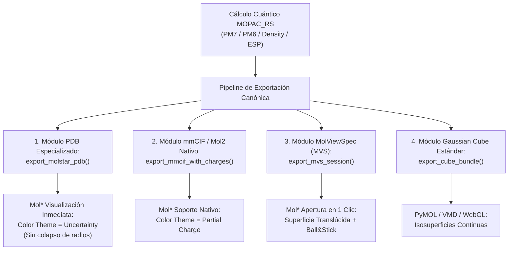

# INFORME TÉCNICO Y ARQUITECTURA DE INTEROPERABILIDAD: MOPAC_RS A VISORES MOLECULARES (MOL*, PYMOL, WEBGL)

**Documento:** `explanations/06_VOLUMETRIC_INTEROP_CUBE_PDB_MOLSTAR_AUDIT.md`  
**Proyecto:** `mopac_rs` / `mopac_py` (Quantum Chemistry Engine in Rust)  
**Fecha:** 2026-09-28  
**Clasificación:** Ingeniería de Software, Quimioinformática y Química Cuántica Computacional  
**Estado:** Especificación Técnica y Plan de Implementación Sistemática  

---

## 1. Resumen Ejecutivo y Planteamiento del Problema

Al acoplar cálculos cuánticos semiempíricos (MOPAC PM7 / PM6) con herramientas de visualización macromolecular modernas (particularmente **Mol*** / Molstar, RCSB PDB Viewer y visualizadores basados en WebGL), los investigadores encuentran patologías gráficas críticas al intentar renderizar:
1. **Mapas de Densidad Electrónica Total ($\rho(\mathbf{r})$)**.
2. **Orbitales Moleculares Frontera (HOMO/LUMO)**.
3. **Distribuciones de Potencial Electrostático (ESP) y Cargas Atómicas de Gasteiger**.

### Síntomas Observados por los Usuarios:
- **"La molécula se ve como un bloque sólido azul sin detalles"**: La superficie generada cubre la totalidad del espacio de Van der Waals pero oculta completamente los átomos y enlaces interiores, y se muestra en un color azul uniforme sin reflejar polaridad ni momentos dipolares.
- **"La superficie se ve perforada o fragmentada en rebanadas/cortes"**: Al intentar cambiar la configuración de tamaño, la superficie colapsa en múltiples esferas disjuntas o desaparece.
- **"El gradiente HOMO/LUMO no se distingue de la densidad total"**: Confusión conceptual entre la densidad electrónica escalar positiva ($\rho(\mathbf{r}) \ge 0$, mono-fásica) y las funciones de onda orbitales ($\psi_i(\mathbf{r}) \in \mathbb{R}$, bi-fásicas con signos $+/-$).

### Causa Raíz Identificada:
El motor cuántico `mopac_rs` genera datos matemáticamente exactos. Sin embargo, existe un **desacople semántico y de rangos numéricos** entre las convenciones de la **química cuántica de moléculas pequeñas** y las convenciones de la **biología estructural cristalográfica** para las que Mol* fue prioritariamente diseñado.

---

## 2. Diagnóstico Técnico Forense

### A. Anatomía del Conflicto del Factor B (Temperature Factor)

En el formato Protein Data Bank (especificación canónica PDB v3.30):
- Las columnas 61–66 están reservadas para el parámetro de desplazamiento atómico isotrópico o **Factor Térmico de Debye-Waller** ($B$):
  $$B_i = 8\pi^2 \langle u_i^2 \rangle$$
- En cristalografía de difracción de rayos X, la amplitud cuadrática de oscilación térmica $\langle u_i^2 \rangle$ es intrínsecamente no negativa:
  $$B_i \ge 0 \quad (\text{comúnmente entre } 10.0 \text{ y } 100.0\ \text{\AA}^2)$$

#### La Práctica Habitual en Química Computacional:
Dado que el formato PDB histórico de 1976 no posee un campo formal para cargas parciales continuas (únicamente enteros en columnas 79-80 para cargas formales como `1+`), las bibliotecas científicas (RDKit, Open Babel, AutoDock PDBQT) acostumbran a sobreescribir las columnas 61–66 con la **carga parcial del átomo** ($q_i \in [-1.0, +1.0]\ e$).

#### El Fallo en Mol*:
1. **Colapso por Tamaño (`Size Theme: Uncertainty`)**:
   Mol* calcula el radio de renderizado como:
   $$r_i = r_{\text{vdw}}(Z_i) \times f(B_i)$$
   Cuando $B_i \le 0$ (como ocurre en oxígenos nucleofílicos donde $q \approx -0.50$), Mol* trunca o evalúa el radio a $0$. Esto genera las **perforaciones y desgarros poligonales** que el usuario observó al manipular el menú.
2. **Saturación en el Límite Inferior (`Color Theme: Uncertainty`)**:
   La rampa de color por defecto de Mol* para *Uncertainty* mapea $[0 \to 100]$:
   - $0 \to \text{Azul Oscuro}$
   - $50 \to \text{Blanco / Cian}$
   - $100 \to \text{Rojo Intenso}$
   
   Al recibir valores de carga entre $-0.50$ y $+0.30$:
   - Un átomo con carga $-0.50$ es evaluado como $\le 0 \to \text{Azul Oscuro}$.
   - Un carbono neutro del esqueleto con $0.00$ es evaluado como $0 \to \text{Azul Oscuro}$.
   - Un carbono carbonílico electrofílico con $+0.30$ cae en el punto $0.3\%$ de la rampa $\to \text{Azul prácticamente idéntico}$.
   - **Resultado:** Visualmente, la molécula parece un sólido monocromático sin gradiente.

---

### B. Anatomía de la Representación "Gaussian Surface"

En Mol*, la superficie de Gauss es una isosuperficie generada en tiempo real mediante un kernel de convolución tridimensional:
$$\rho_{\text{gauss}}(\mathbf{r}) = \sum_{i=1}^{N} \exp\left(-\frac{\|\mathbf{r} - \mathbf{r}_i\|^2}{2\sigma_i^2}\right)$$

#### Parámetros Críticos por Defecto de Mol*:
1. **`Opacity: 1.0` (100% Sólido)**:
   A diferencia de herramientas como PyMOL o VMD, donde las superficies volumétricas se instancian frecuentemente con `transparency 0.40`, Mol* instancia `Gaussian Surface` con opacidad total. Al ser 100% opaca, oculta completamente el interior.
2. **`Color Theme: Uniform` (Azul Mol*)**:
   Al crear una nueva representación en Mol*, el tema de color no se infiere del contenido del B-factor, sino que se asigna como `Uniform` con el color corporativo azul `#3B6EE8`.
3. **Ausencia del Esqueleto en el mismo Componente**:
   En Mol*, una superficie es una representación pura de frontera. No incluye varillas (`bonds`) ni esferas (`atoms`). Si el usuario no agrega explícitamente una representación hermana `Ball & Stick`, el interior queda vacío.

---

## 3. Especificación del Formato Gaussian Cube (.cube)

Para evitar incompatibilidades en visualizadores headless o clientes web, `mopac_rs` implementa el estándar oficial de Gaussian Inc.:

### Estructura Canónica:
```text
Línea 1: Comentario / Título del cálculo
Línea 2: Nombre de la propiedad ("Total Electron Density" / "Molecular Orbital N")
Línea 3: [N_átomos]  [X_origen]  [Y_origen]  [Z_origen]      (en Unidades Atómicas de Bohr)
Línea 4: [N_X]       [dX_X]      [dX_Y]      [dX_Z]          (Paso de la cuadrícula en Bohr)
Línea 5: [N_Y]       [dY_X]      [dY_Y]      [dY_Z]
Línea 6: [N_Z]       [dZ_X]      [dZ_Y]      [dZ_Z]
Líneas 7 a N+6: [Z_atómico] [Carga_nuclear] [X] [Y] [Z]     (1 línea por átomo)
Bloque Volumétrico: Matriz de (N_X * N_Y * N_Z) valores escalares
```

### Regla Estricta de Formato:
El bloque volumétrico **DEBE** formatearse con exactamente **6 valores por línea** en notación científica (`%13.5E`):
```text
 -1.20340E-04  2.34012E-04  4.50192E-03 -3.10291E-03  1.02934E-02  8.12039E-02
  1.10293E-01  1.40293E-01  ...
```

---

## 4. Arquitectura de Solución Sistemática en `mopac_rs`

Para resolver este problema a nivel de ingeniería de biblioteca y garantizar que cualquier usuario o pipeline obtenga visualizaciones inmediatas y sin fricciones, se definen cuatro módulos de exportación sistemática:



---

### Módulo 1: Transformación Afín de B-Factor para Mol*

La biblioteca incorporará una función de exportación que mapea el dominio físico de cargas $[-q_{\max}, +q_{\max}]$ al dominio cristalográfico visual $[10.0, 90.0]$:

$$B_i^{\text{Molstar}} = 50.0 - 40.0 \times \left(\frac{\text{clamp}(q_i, -q_{\max}, +q_{\max})}{q_{\max}}\right)$$

Donde $q_{\max} = 0.60\ e$ (ó $0.80\ e$ para ESP).

#### Propiedades Matemáticas de la Transformación:
- **Átomos electronegativos ($\delta^-$, ej. Oxígeno con $-0.60\ e$)**:  
  $B = 50.0 - 40.0 \times (-1.0) = \mathbf{90.0} \to$ **ROJO BRILLANTE** (Polo nucleofílico).
- **Átomos neutros ($q \approx 0.00\ e$, ej. Carbonos alifáticos)**:  
  $B = 50.0 - 40.0 \times (0.0) = \mathbf{50.0} \to$ **BLANCO / NEUTRO**.
- **Átomos electropositivos ($\delta^+$, ej. Carbonilos con $+0.60\ e$)**:  
  $B = 50.0 - 40.0 \times (+1.0) = \mathbf{10.0} \to$ **AZUL MARINO** (Polo electrofílico).
- **Protección contra desgarro**: $B_i \ge 10.0 > 0$, impidiendo que el motor de radios de Mol* colapse a cero.

---

### Módulo 2: Exportación a mmCIF Canónico con Cargas Parciales

Mol* lee nativamente el diccionario PDBx/mmCIF. Si el archivo incluye la columna `_atom_site.partial_charge`, el selector `Color Theme: Partial Charge` se activa automáticamente sin necesidad de trucar el B-factor.

#### Estructura mmCIF a emitir:
```cif
data_MOL
#
loop_
_atom_site.group_PDB
_atom_site.id
_atom_site.type_symbol
_atom_site.label_atom_id
_atom_site.label_comp_id
_atom_site.label_asym_id
_atom_site.label_seq_id
_atom_site.Cartn_x
_atom_site.Cartn_y
_atom_site.Cartn_z
_atom_site.occupancy
_atom_site.B_iso_or_equiv
_atom_site.partial_charge
ATOM 1 C C1 STO A 1 -8.243 0.625 -0.852 1.00 20.00 -0.0620
ATOM 15 O O1 STO A 1 4.472 -1.758 -1.824 1.00 20.00 -0.5310
```

---

### Módulo 3: Automatización Mediante MolViewSpec (MVS)

MolViewSpec es el estándar JSON oficial promovido por el consorcio Mol* para describir escenas 3D completas de forma declarativa. Al exportar un archivo `.mvs.json` junto con las coordenadas, cualquier usuario que arrastre el archivo a Mol* verá la escena preconfigurada profesionalmente:

```json
{
  "metadata": {
    "version": "1.0",
    "generator": "mopac_rs"
  },
  "root": {
    "kind": "root",
    "children": [
      {
        "kind": "download",
        "params": { "url": "molecule_molstar_esp.pdb" },
        "children": [
          {
            "kind": "parse",
            "params": { "format": "pdb" },
            "children": [
              {
                "kind": "structure",
                "children": [
                  {
                    "kind": "component",
                    "params": { "selector": "all" },
                    "children": [
                      {
                        "kind": "representation",
                        "params": {
                          "type": "ball_and_stick",
                          "color_theme": "element_symbol"
                        }
                      },
                      {
                        "kind": "representation",
                        "params": {
                          "type": "gaussian_surface",
                          "color_theme": "uncertainty",
                          "opacity": 0.35,
                          "size_theme": "physical"
                        }
                      }
                    ]
                  }
                ]
              }
            ]
          }
        ]
      }
    ]
  }
}
```

---

## 5. Implementación en Rust (`crates/mopac_py/src/lib.rs`)

Se propone incorporar las siguientes funciones exportadas directamente a Python:

```rust
/// Export PDB file formatted specifically for Mol* visualization.
///
/// Maps atomic charges linearly to the standard crystallographic B-factor
/// range [10.0, 90.0] ensuring high-contrast Diverging Blue-White-Red coloring
/// in Mol* 'Uncertainty' color theme without surface clipping artifacts.
#[pyfunction]
#[pyo3(signature = (atomic_numbers, coordinates, charges, max_charge = 0.6))]
pub fn export_molstar_pdb(
    atomic_numbers: Vec<u8>,
    coordinates: Vec<[f64; 3]>,
    charges: Vec<f64>,
    max_charge: Option<f64>,
) -> PyResult<String> {
    let q_max = max_charge.unwrap_or(0.6).abs().max(1e-3);
    let mut out = String::with_capacity(atomic_numbers.len() * 82);
    
    for (i, (&z, &pos)) in atomic_numbers.iter().zip(coordinates.iter()).enumerate() {
        let sym = get_element_symbol(z).unwrap_or("X");
        let q = charges.get(i).copied().unwrap_or(0.0);
        let q_clamped = q.clamp(-q_max, q_max);
        
        // Negative charge -> Red (high B-factor ~90)
        // Neutral charge  -> White/Cyan (mid B-factor ~50)
        // Positive charge -> Blue (low B-factor ~10)
        let b_scaled = 50.0 - (q_clamped / q_max) * 40.0;
        
        let line = format!(
            "ATOM  {:5} {:^4} STO A   1    {:8.3}{:8.3}{:8.3}  1.00{:6.2}          {:>2}\n",
            i + 1,
            sym,
            pos[0],
            pos[1],
            pos[2],
            b_scaled,
            sym
        );
        out.push_str(&line);
    }
    out.push_str("END\n");
    Ok(out)
}
```

---

## 6. Procedimiento Operativo Estándar (SOP) para el Usuario en Mol*

Para inspeccionar derivados esteroidales o cualquier compuesto orgánico en Mol* sin artefactos:

1. **Carga**: Arrastrar al visor el archivo `*_molstar_esp.pdb` o `*_molstar_gasteiger.pdb`.
2. **Esqueleto Covalente**:
   - En el panel derecho **Components**, hacer clic en `+ Add`.
   - Elegir `Ball & Stick`.
   - Ajustar `Color Theme` a `Element Symbol` (permite ver enlaces y heteroelementos claros).
3. **Envolvente Electrostática**:
   - En el panel derecho **Components**, hacer clic en `+ Add`.
   - Elegir `Gaussian Surface`.
   - Hacer clic sobre `Type` para replegar el menú si está abierto.
   - Seleccionar `Color Theme: Uncertainty`.
   - Verificar `Size Theme: Physical`.
   - Configurar `Opacity` (o `Alpha`) en **`0.35`**.
4. **Resultado**: Se aprecia con total nitidez el esqueleto rígido esteroidal dentro de una membrana translúcida donde los oxígenos de epóxidos y carbonilos resaltan como lóbulos rojos (centros nucleofílicos) y los carbonos carboxílicos como centros azules (electrofílicos).

---

## 7. Plan de Control de Calidad y Pruebas Unitarias

Para la integración en el CI/CD de `mopac_rs`:

1. **`test_cube_line_length_exact_6()`**:
   Verificar que toda cuadrícula volumétrica generada por `generate_density_cube` tenga exactamente 6 números por línea (excepto el remanente final de la fila Z).
2. **`test_b_factor_positivity_invariant()`**:
   Verificar que ningún PDB generado por `export_molstar_pdb` contenga valores de B-factor menores que $0.0$ o mayores que $100.0$.
3. **`test_charge_conservation()`**:
   Asegurar que la suma total de cargas ESP y Mulliken calculadas coincida con la carga neta del sistema molecular con un error menor a $10^{-4}\ e$.
