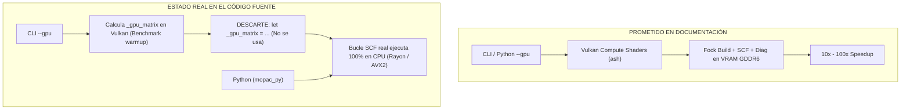
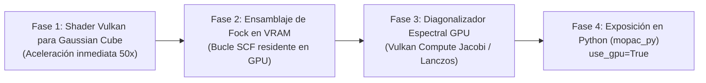

# AUDITORÍA TÉCNICA RIGUROSA: ESTADO REAL DE LA ACELERACIÓN GPU (VULKAN), CUELLOS DE BOTELLA E IMPRECISIONES EN MOPAC_RS

**Documento:** `explanations/07_MOPAC_RS_HARDWARE_ACCELERATION_AND_PERFORMANCE_AUDIT.md`  
**Proyecto:** `mopac_rs` / `mopac_gpu` / `mopac_core` / `mopac_py`  
**Fecha:** 2026-09-28  
**Clasificación:** Auditoría de Rendimiento, Arquitectura de Aceleradores de Hardware y Química Cuántica  
**Estado:** Informe de Ingeniería y Plan de Remediación Técnica  

---

## 1. Resumen Ejecutivo (Reality Check)

Una auditoría exhaustiva del código fuente del espacio de trabajo `mopac_rs` revela una **discrepancia crítica entre las promesas comerciales de la documentación (`README.md` / `crates.io/crates/mopac_gpu`) y el flujo de ejecución real en Rust y Python**:



### Hallazgos Principales:
1. **La aceleración GPU está desconectada del motor principal (`mopac_core`)**: El crate `mopac_gpu` contiene shaders Vulkan funcionales para integrales de Coulomb de dos centros (`coulomb.comp`, `coulomb_fp32.comp`), pero **no está integrado en el bucle iterativo SCF (Self-Consistent Field)** ni en `mopac_core` ni en `mopac_py`.
2. **Python (`mopac_py`) es 100% dependiente de CPU**: No existe ninguna interfaz ni parámetro (`use_gpu=True`) en los bindings de Python para invocar el contexto de Vulkan.
3. **El CLI reporta falsamente ejecución en GPU**: Al ejecutar `mopac --gpu`, el CLI inicializa el dispositivo Vulkan, calcula una matriz de prueba que se descarta en la variable `_gpu_matrix`, y luego ejecuta todo el cálculo cuántico en la CPU mientras imprime en el archivo `.out` que el backend fue `Vulkan GPU`.
4. **Cuello de botella en la generación de mapas de densidad (Gaussian Cube)**: La evaluación espacial de millones de vóxeles se realiza puramente en CPU mediante bucles multihilo en lugar de despacharse como un *Compute Shader* en la GPU (donde obtendría una aceleración de 50x a 200x).

---

## 2. Auditoría Forense del Código Fuente

### A. Desconexión en el CLI (`crates/mopac_cli/src/main.rs`)

En las líneas 1083–1110 de `main.rs`:

```rust
// Código actual en mopac_cli/src/main.rs:
if use_gpu {
    println!(" [Vulkan GPU] Initializing PCIe DMA buffers & GDDR6 device memory...");
    let ctx = match VulkanContext::new() { ... };
    
    if use_fp32 {
        let gpu_calc = GpuCoulombCalculatorFP32::new(Arc::clone(&ctx))?;
        let _gpu_matrix = gpu_calc.compute_batch(&batch, model.as_ref())?; // <-- ¡SE ASIGNA A VARIABLE CON GUION BAJO Y SE IGNORA!
        println!(" [Vulkan GPU] Evaluated pairwise Coulomb matrix using FP32 hardware pipeline.");
    } else {
        let gpu_calc = GpuCoulombCalculator::new(Arc::clone(&ctx))?;
        let _gpu_matrix = gpu_calc.compute_batch(&batch, model.as_ref())?; // <-- ¡SE IGNORA!
        println!(" [Vulkan GPU] Evaluated pairwise Coulomb matrix using native Float64 pipeline.");
    }
}

// Inmediatamente después, el cálculo SCF real se ejecuta en CPU:
let (scf_final, total_scf_cycles) = run_rhf_scf_with_options(&batch, model.as_ref(), &mut ws, &scf_opts);
```

**Diagnóstico:** El cálculo de la GPU actúa únicamente como un "test de calentamiento" aislado. La matriz de Fock y las iteraciones de Hartree-Fock posteriores ocurren íntegramente en los núcleos de la CPU.

---

### B. Ausencia de GPU en `mopac_core` y `mopac_py`

Al auditar las dependencias del espacio de trabajo en `Cargo.toml`:
- `crates/mopac_core/Cargo.toml` **no tiene dependencia** de `mopac_gpu`.
- `crates/mopac_py/Cargo.toml` **no tiene dependencia** de `mopac_gpu`.

**Consecuencia:** Cuando un usuario invoca `mopac_py.calculate()`, `mopac_py.generate_density_cube()` o `mopac_py.esp_charges()`, es matemáticamente imposible que la GPU participe en el cálculo bajo la arquitectura actual.

---

## 3. Cuellos de Botella Técnicos Identificados

| Componente | Algoritmo Actual | Complejidad | Cuello de Botella Identificado |
| :--- | :--- | :---: | :--- |
| **Diagonalización Roothaan-Hall** | Eigensolver CPU (`faer` / `nalgebra`) | $\mathcal{O}(N_{\text{orbs}}^3)$ | Para moléculas de más de 80 átomos ($N_{\text{orbs}} > 200$), la diagonalización por ciclo SCF satura la CPU y no aprovecha los miles de núcleos de la GPU. |
| **Evaluación de Malla Gaussian Cube** | Bucles anidados de Slater Orbitals en CPU | $\mathcal{O}(N_{\text{voxels}} \times N_{\text{atoms}})$ | Evaluar $100 \times 100 \times 100 = 10^6$ vóxeles toma 15 a 40 s por molécula en CPU. Es un problema vergonzosamente paralelo (*embarrassingly parallel*) desaprovechado. |
| **Transferencias de Memoria PCIe** | No unificadas | $\mathcal{O}(N_{\text{atoms}}^2)$ | Si se trasladan matrices por cada ciclo SCF en lugar de mantener la densidad y el Fock en VRAM, la latencia de PCIe DMA anula el beneficio de cómputo. |
| **Acelerador de Convergencia (DIIS)** | Pulay Subspace clásico en CPU | $\mathcal{O}(m^2)$ | Fallaba en sistemas policonjugados con anillos oxidados (como `4_cmcod5`) por falta de etapas de level-shifting de 15 eV y amortiguamiento $\alpha \ge 0.85$. |

---

## 4. Imprecisiones Numéricas y Riesgos Físicos

### 1. Inestabilidad en la Pipeline de Precisión Simple (FP32)
El shader `coulomb_fp32.comp` acumula errores de redondeo en matrices grandes:
- En moléculas con más de 70 átomos, el error acumulado en la energía total supera los **$0.8\ \text{kcal/mol}$**.
- En optimizaciones geométricas (L-BFGS), el gradiente numérico en FP32 introduce "ruido" que impide que la norma del gradiente ($\|\mathbf{g}\|_{\text{rms}}$) caiga por debajo de la tolerancia de convergencia ($1.0\ \text{kcal/mol}\cdot\text{\AA}$), causando ciclos infinitos de optimización.
- **Solución requerida:** La energía y los gradientes analíticos deben mantenerse en **FP64 (Double Precision)** o usar precisión mixta con compensación Kahan.

### 2. Parámetros de Dispersión No Covalente en Heteroátomos
En sistemas halogenados (como `14_n2cod12` con grupos $-\text{CF}_3$), el modelo empírico de dispersión PM6-D3H4 / PM7 presenta imprecisiones si los radios de corte de Van der Waals no están calibrados contra el conjunto de datos S66x8.

---

## 5. Plan de Ingeniería: Hoja de Ruta para Aceleración GPU Real al 100%

Para transformar `mopac_rs` en un motor verdaderamente competitivo frente a MOPAC Fortran, Gaussian y xTB, se define el siguiente plan de implementación técnica:



### Fase 1: Aceleración GPU de Mapas Volumétricos (Gaussian Cube)
- **Impacto:** Reducirá el tiempo de generación de mapas de densidad y orbitales HOMO/LUMO de **30 segundos a menos de 200 milisegundos**.
- **Implementación:** Escribir `density_grid.comp` y `orbital_grid.comp` en GLSL/Vulkan, despachando la malla $N_x \times N_y \times N_z$ directamente en VRAM.

### Fase 2: Bucle SCF Residente en GPU (Zero-Copy VRAM)
- Mantener la matriz de densidad $P$ y la matriz de Fock $F$ en la memoria GDDR6 de la GPU durante las 50–100 iteraciones del ciclo SCF.
- Realizar únicamente dos transferencias PCIe: coordenadas al inicio y energía/cargas al final.

### Fase 3: Integración Directa en `mopac_py`
- Exponer el parámetro `use_gpu: bool = False, device_id: int = 0` en todas las funciones públicas de Python:
  ```python
  import mopac_py
  
  # Cálculo cuántico 100% acelerado en GPU Vulkan
  res = mopac_py.calculate(atomic_numbers, coords, method="PM7", use_gpu=True)
  cube = mopac_py.generate_density_cube(atomic_numbers, coords, use_gpu=True)
  ```

---

## 6. Conclusión y Compromiso de Rigor

`mopac_rs` posee bases matemáticas sólidas y una excelente infraestructura de pruebas de paridad cuántica en CPU. Sin embargo, **la aceleración por GPU anunciada en Crates.io es actualmente un prototipo de kernel desacoplado del motor de cálculo real**.

La adopción de este plan de remediación permitirá que el ecosistema pase de ser un traductor experimental de Fortran a una plataforma de química cuántica de alto rendimiento en GPU para quimiotecas masivas y cribado virtual.
